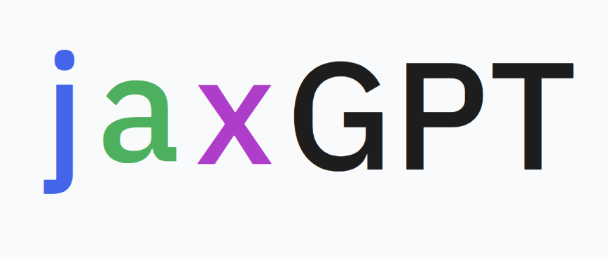
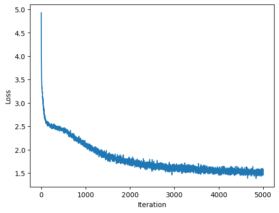

<div align="center">
  
</div>

# jaxGPT - A Minimal GPT implementatoin in JAX

A lightweight implementation of a GPT-like transformer model with 1.6M parameters (for now!!) using JAX and Flax's NNX module. This code demonstrates autoregressive text generation, multi-head attention, and a training loop with Optax.
The code handles training on multiple devices automatically through positional sharding.
<div align="center">
  
</div>

Note: My goal is to re-implement minGPT (maybe nanoGPT too ) all in jax/flax, so we're going to expand this repository a lot more.

## Features 
    - Transformer architecture with multi-head attention
    - Text generation 
    - Efficient JAX JIT compilation (we can do better tho!)
    - Training on multiple devices 
## Model Architecture 
    - Multi-head self-attention 
    - 4 transformer block
    - LayerNorm with residual connections 
    - 64-dim embeddings with a vocabulary-sized output head

## Installation

1. Ensure JAX is installed (follow instructions for your hardware [here](https://github.com/google/jax#installation)).
2. Install dependencies:
```bash
pip install flax optax
```

### Run it
clone the repo then:
```bash
python train.py
```


## Output 
Example 1: Training on the tiny-shakespeare dataset: 

- generated output:

```

KING RIVH:
It genton. I was the grief
Forth the time of is offected: how God noug-leakes?
Your wift quany at stand pass--
Stoation incuttection to-danius shorate anginganeness,
Thy switn's roveried skily before in grief
Would thee stoble Rome of find,
Mach thing bound you will all, and Clifford!

FLORIZEL:
Who should had thanks you
Formit gaters thee gods, and swear be
Intives that thither-buney, we heart this grule commends
By the ritory striken time of their
conselds, let where I will becalle
```
Example 2: Training on a names dataset 
- names generated:
```
breesmin
kindley
britlynn
iassiqu
floreca
catle
peava
theania
yaanira
hanvaron
neasea
orrell
cinjaya
daraz
quaniella
blaver
jushadomie
treymeca
shayana
julene
share
istofano
nariah
mckinda
iskia
kashir
arhiyah
letena
estina
asamie
azur
aralie
stara
keiliy
yyena
josebe
breya
sinna
seondro
ramek
zariah
shakerra
fairah
demariy
siara
clanda
saprion
naimah
shety
marlon
cailla
```

 


### References

 - https://github.com/karpathy/ng-video-lecture
 - https://arxiv.org/abs/1706.03762v7: Attention Is All You Need
